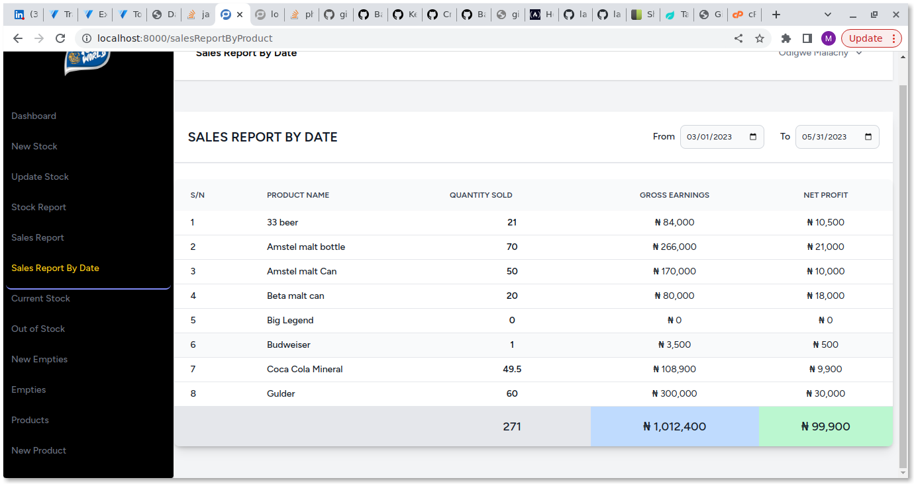

# Drinks distribution Inventory Management System #
## Built on  Laravel Vuejs TawlindCss techstack  using vite bundler ##

This project enables drinks wholesale distributors to manage and monitor their stocks. It includes adding new drinks for stock, making sales through the system, taking stock of inventories on the store, getting updates on the returns and profit.

The system enables the manager to keep record of stocks: dates they entered and at what price. It also provides room for the sales agent to make sales through the system

The system automatically generates records of the expected sales return and show records of sales with any period selected. It also gives alert of outstock drinks and showcases the current selling price for each product/drink at any point in time.

Here are some screenshots of the product

### Credits ###
This project was built for a classmate and friend, Tofan World Stores Nigeria

*** Note This for demostration purposes and must not be cloned ***
